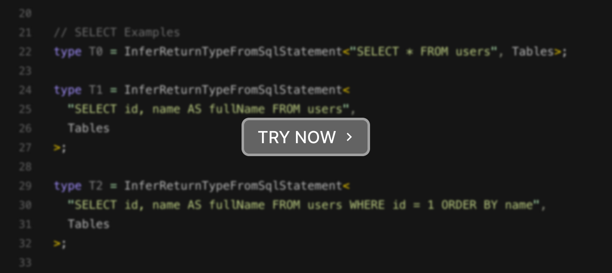

# type-safe-sql-query

<div align="center">
  
  <h3>Bridging the Gap Between SQL and TypeScript Types</h3>
  <p>Write traditional SQL queries with an added layer of reliability and scalability.</p>
</div>

## About

`type-safe-sql-query` provides two well-tested util types

- `InferReturnTypeFromSqlStatement`
- `InferParamsTypeFromSqlStatement`

that allow us to automatically infer the return type and the parameter type of a SQL statement. e.g.:

```ts
type T0 = InferReturnTypeFromSqlStatement<"SELECT * FROM users", Tables>;
// => { id: number, name: string, age: number, email: string }[]
```

Feel free to be creative and use them however you like.

[](https://stackblitz.com/edit/type-safe-sql-query-demo?file=src%2Fmain.ts&view=editor)

## Articles

Please check out our articles

- especially if you are **unsure whether you want to use an ORM or raw SQL**?
- or want to learn more about the motivation and the background of this project?

Articles:

- [Handling remote data - What scales well and what doesn't](/docs/handling-remote-data.md)
- [Do we need an Abstraction for SQL?](/docs/do-we-need-an-abstraction-for-sql.md)

## Features

- ✅ **Automatic type inference** from SQL statements.
- ✅ **No compilation** step
- ✅ **No runtime overhead**. 🏎️
- ✅ **No new language or API**. 🧠
- ✅ **Zero dependencies.**
- ✅ Minimalistic and **easy to use**.
- ✅ **Well-tested**
- ✅ MIT License

## Roadmap / Current Status

> ⚠️ Please note that this project is in a very early stage and is not yet ready for production use.

The MVP of this project is to support basic CRUD operations on a single table. The following is a list features that are already implemented or are planned to be implemented.

Legend:

- 📝: Planned
- 🏗️: In Progress
- ✅: Done

### InferReturnTypeFromSqlStatement

| Feature                         | Status |
| ------------------------------- | ------ |
| Support for `INSERT` statements | ✅     |
| Support for `UPDATE` statements | ✅     |
| Support for `DELETE` statements | ✅     |
| Support for `SELECT` statements | 🏗️     |

### InferParamsTypeFromSqlStatement

| Feature                         | Status |
| ------------------------------- | ------ |
| Support for `INSERT` statements | ✅     |
| Support for `UPDATE` statements | ✅     |
| Support for `DELETE` statements | ✅     |
| Support for `SELECT` statements | 🏗️     |

For more details please check the source code and the test files.

## Installation

```bash
npm install -D type-safe-sql-query

# or
yarn add -D type-safe-sql-query

# or
pnpm add -D type-safe-sql-query
```

## Basic Usage

The following examples demonstrates how to use `type-safe-sql-query` with MySQL.

```ts
import type { InferReturnTypeFromSqlStatement, InferParamsTypeFromSqlStatement } from "type-safe-sql-query";
import type { DB } from "./db";

type Result = InferReturnTypeFromSqlStatement<"SELECT * FROM users WHERE name = ? AND age > ?", DB>;
// Result is: { id: number, name: string, age: number, email: string }[]

type Params = InferParamsTypeFromSqlStatement<"SELECT * FROM users WHERE name = ? AND age > ?", DB>;
// Params is: [string, number]

type ResultWithAlias = InferReturnTypeFromSqlStatement<"SELECT name AS fullName, age FROM Users", DB>;
// ResultWithAlias is: { fullName: string, age: number }[]
```

The example above assumes that we have a file called `db.ts` that contains the type information of our database tables.

```ts
// db.ts (auto-generated)

type UsersTable = {
  id: number;
  name: string;
  age: number;
  email: string;
};

export type DB = {
  users: UsersTable;
  // ...
};
```

## Creating the `DB` Type

No sql-query tool can provide type safety without knowing the database structure.

This is where the concept of the `DB` type comes into play. The `DB` type contains the type information of all tables in the database, providing a structured and type-safe interface for database operations. The previous section contains a typical example of the `DB` type to showcase how this concept is applied in practice.

Our approach aligns with the methodologies employed by [Kysely](https://kysely.dev/), a library known for its robust type safety features. By utilizing the same `DB` types as those defined in Kysely, we can leverage any tool compatible with Kysely to automatically generate the `DB` type for our database. This compatibility opens up a wide range of possibilities for enhancing our application's reliability and type safety, making the integration process seamless and efficient.

- [Getting Started - Types](https://kysely.dev/docs/getting-started#types)
- [Kysely - Generating types](https://kysely.dev/docs/generating-types)
  - We recommend using [kysely-codegen](https://github.com/RobinBlomberg/kysely-codegen).

Note: [schemats](https://github.com/SweetIQ/schemats) and [sqlx-ts](https://github.com/JasonShin/sqlx-ts) might also work but have not been tested yet.

Of course, you can also manually create the `DB` type. However, this is error-prone and strongly discouraged by the authors of this package.

### Usage with Low Level Database Drivers

The following example demonstrates how to use `type-safe-sql-query` with the [mysql2](https://github.com/sidorares/node-mysql2) driver.

```ts
import mysql from "mysql2/promise";
import type { InferParamsTypeFromSqlStatement, InferParamsFromSqlStatement } from "type-safe-sql-query";
import type { DB } from "./db";

// Create the connection to database
const connection = await mysql.createConnection({
  host: "localhost",
  user: "root",
  database: "test",
});

// Create a type-safe query wrapper
async function query<S extends string>(
  sql: S,
  params: InferParamsTypeFromSqlStatement<S, DB>,
): InferReturnTypeFromSqlStatement<S, DB> {
  const [results] = await connection.query(sql, params);
  return results as any;
}

// Use the type-safe query wrapper to query the database.
const users = await query("SELECT * FROM users WHERE name = ? AND age > ?", ["Michael", 36]);
```

Other low level database drivers like [mysql](https://github.com/mysqljs/mysql), [postgres](https://github.com/porsager/postgres) or [pg](https://node-postgres.com/) should work similarly.
