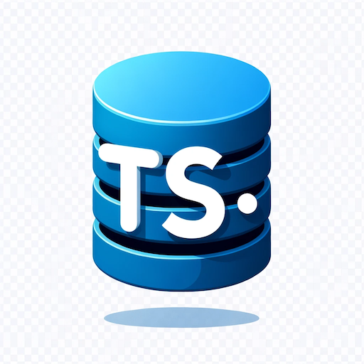
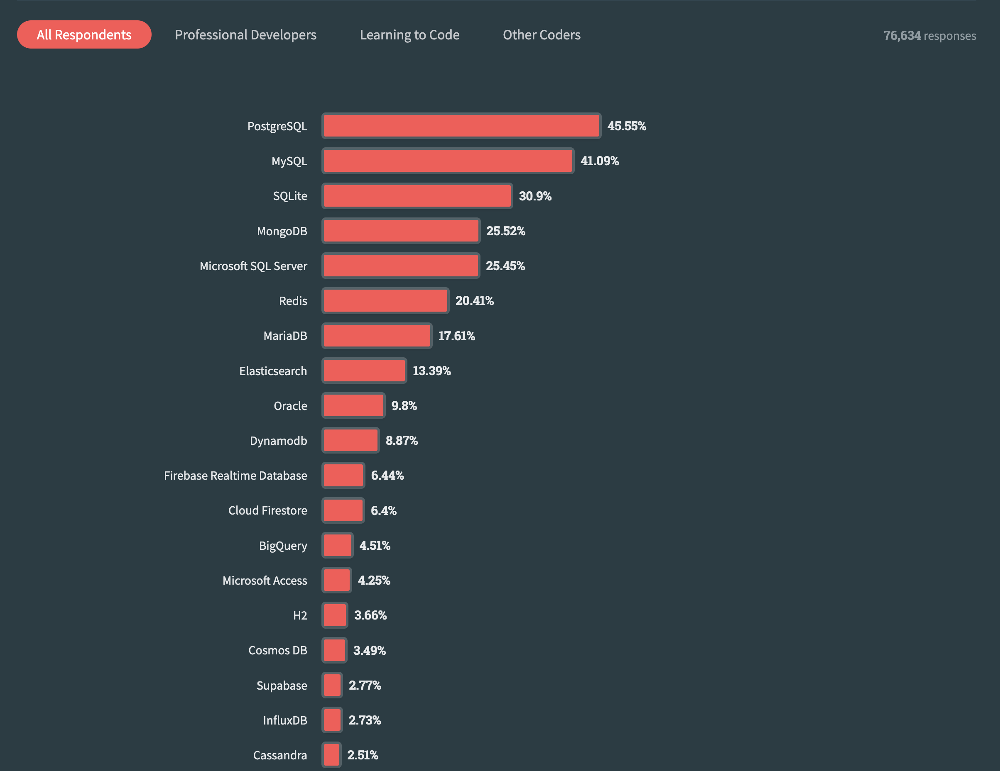

# Sql2TypeScript

<div align="center">
  
  <h3>Bridging the Gap Between SQL and TypeScript Types</h3>
  <a href="https://codesandbox.io/p/devbox/sql2typescript-demo-9g7dly?layout=%257B%2522sidebarPanel%2522%253A%2522EXPLORER%2522%252C%2522rootPanelGroup%2522%253A%257B%2522direction%2522%253A%2522horizontal%2522%252C%2522contentType%2522%253A%2522UNKNOWN%2522%252C%2522type%2522%253A%2522PANEL_GROUP%2522%252C%2522id%2522%253A%2522ROOT_LAYOUT%2522%252C%2522panels%2522%253A%255B%257B%2522type%2522%253A%2522PANEL_GROUP%2522%252C%2522contentType%2522%253A%2522UNKNOWN%2522%252C%2522direction%2522%253A%2522vertical%2522%252C%2522id%2522%253A%2522cls3bnup100063b6h1wdkn9p6%2522%252C%2522sizes%2522%253A%255B70%252C30%255D%252C%2522panels%2522%253A%255B%257B%2522type%2522%253A%2522PANEL_GROUP%2522%252C%2522contentType%2522%253A%2522EDITOR%2522%252C%2522direction%2522%253A%2522horizontal%2522%252C%2522id%2522%253A%2522EDITOR%2522%252C%2522panels%2522%253A%255B%257B%2522type%2522%253A%2522PANEL%2522%252C%2522contentType%2522%253A%2522EDITOR%2522%252C%2522id%2522%253A%2522cls3bnup100023b6htvz9kv1b%2522%257D%255D%257D%252C%257B%2522type%2522%253A%2522PANEL_GROUP%2522%252C%2522contentType%2522%253A%2522SHELLS%2522%252C%2522direction%2522%253A%2522horizontal%2522%252C%2522id%2522%253A%2522SHELLS%2522%252C%2522panels%2522%253A%255B%257B%2522type%2522%253A%2522PANEL%2522%252C%2522contentType%2522%253A%2522SHELLS%2522%252C%2522id%2522%253A%2522cls3bnup100043b6hhpkd4mhz%2522%257D%255D%252C%2522sizes%2522%253A%255B100%255D%257D%255D%257D%252C%257B%2522type%2522%253A%2522PANEL_GROUP%2522%252C%2522contentType%2522%253A%2522DEVTOOLS%2522%252C%2522direction%2522%253A%2522vertical%2522%252C%2522id%2522%253A%2522DEVTOOLS%2522%252C%2522panels%2522%253A%255B%257B%2522type%2522%253A%2522PANEL%2522%252C%2522contentType%2522%253A%2522DEVTOOLS%2522%252C%2522id%2522%253A%2522cls3bnup100053b6hke9t9lg9%2522%257D%255D%252C%2522sizes%2522%253A%255B100%255D%257D%255D%252C%2522sizes%2522%253A%255B100%252C0%255D%257D%252C%2522tabbedPanels%2522%253A%257B%2522cls3bnup100023b6htvz9kv1b%2522%253A%257B%2522id%2522%253A%2522cls3bnup100023b6htvz9kv1b%2522%252C%2522tabs%2522%253A%255B%255D%257D%252C%2522cls3bnup100053b6hke9t9lg9%2522%253A%257B%2522id%2522%253A%2522cls3bnup100053b6hke9t9lg9%2522%252C%2522tabs%2522%253A%255B%255D%257D%252C%2522cls3bnup100043b6hhpkd4mhz%2522%253A%257B%2522id%2522%253A%2522cls3bnup100043b6hhpkd4mhz%2522%252C%2522tabs%2522%253A%255B%257B%2522id%2522%253A%2522cls3ctta3002o3b6hlhau0ka9%2522%252C%2522mode%2522%253A%2522permanent%2522%252C%2522type%2522%253A%2522TERMINAL%2522%252C%2522shellId%2522%253A%2522cls3cttbn001idaga9v5y33ck%2522%257D%255D%252C%2522activeTabId%2522%253A%2522cls3ctta3002o3b6hlhau0ka9%2522%257D%257D%252C%2522showDevtools%2522%253Afalse%252C%2522showShells%2522%253Atrue%252C%2522showSidebar%2522%253Atrue%252C%2522sidebarPanelSize%2522%253A15%257D">Try now</a> •
  <a href="#features">Features</a> •
  <a href="/">Docs</a> •
  <a href="/docs/roadmap">Roadmap</a> •
  <a href="/">FAQ</a>
</div>

## What is Sql2TypeScript?

`sql2typescript` is a **type-safe** SQL query wrapper for TypeScript. It's a **zero dependency** library that uses the database as the **single source of truth**.

## Features

- ✅ DB as **single source of truth** => no schema drift.
- ✅ **Automatic type-safe** SQL queries.
- ✅ **No compilation** step
- ✅ **No runtime overhead**.
- ✅ **Zero dependencies.**
- ✅ **No ORM** => **No leaky abstractions** => **No magic**. ✨
- ✅ **Simple and familiar**

## Installation

```bash
npm install -D sql2typescript

# or
yarn add -D sql2typescript

# or
pnpm add -D sql2typescript
```

## Basic Usage

The following examples demonstrates how to use `sql2typescript` with MySQL.

```ts
import type { InferReturnTypeFromSqlStatement, InferParamsTypeFromSqlStatement } from "sql2typescript";
import type { Tables } from "./tables";

type Result = InferReturnTypeFromSqlStatement<"SELECT * FROM users WHERE name = ? AND age > ?", Tables>;
// Result is: { id: number, name: string, age: number, email: string }[]

type Params = InferParamsTypeFromSqlStatement<"SELECT * FROM users WHERE name = ? AND age > ?", Tables>;
// Params is: [string, number]

type ResultWithAlias = InferReturnTypeFromSqlStatement<"SELECT name AS fullName, age FROM Users", Tables>;
// ResultWithAlias is: { fullName: string, age: number }[]
```

The examples above assumes that we have a file called `tables.ts` that contains the type information of our database tables. This file should be auto-generated with [schemats](https://github.com/sweetiq/schemats) for example.

```ts
// tables.ts (auto-generated with schemats)

export type Tables = {
  users: {
    id: number;
    name: string;
    age: number;
    email: string;
  };
  // ...
};
```

### Usage with Low Level Database Drivers

The following example demonstrates how to use `sql2typescript` with the [mysql2](https://github.com/sidorares/node-mysql2) driver.

```ts
import mysql from "mysql2/promise";
import type { InferParamsTypeFromSqlStatement, InferParamsFromSqlStatement } from "sql2typescript";
import type { Tables } from "./tables";

// Create the connection to database
const connection = await mysql.createConnection({
  host: "localhost",
  user: "root",
  database: "test",
});

// Create a type-safe query wrapper
async function queryWrapper<S extends string>(
  sql: S,
  params: InferParamsTypeFromSqlStatement<S, Tables>,
): InferReturnTypeFromSqlStatement<S, Tables> {
  const [results] = await connection.query(sql, params);
  return results as any;
}

// Use the type-safe query wrapper to query the database.
const users = await queryWrapper("SELECT * FROM users WHERE name = ? AND age > ?", ["Michael", 36]);
```

Other low level database drivers like [mysql](https://github.com/mysqljs/mysql), [postgres](https://github.com/porsager/postgres) or [pg](https://node-postgres.com/) should work similarly.

## Why?

- ORMs and SQL Query Builders tend to be leaky abstractions. => Many people prefer writing SQL directly.
- ORMs and SQL Query Builders do not use the database as the source of truth. => Potential schema drift.
- Most ORMs and Query Builders are just wrappers around common packages/drivers like [mysql](https://github.com/mysqljs/mysql), [mysql2](https://github.com/sidorares/node-mysql2), [postgres](https://github.com/porsager/postgres) or [pg](https://node-postgres.com/). => Unnecessary performance/runtime overhead.
- Having a dedicated compilation step that depends on the target platform (e.g., [Prisma](https://www.prisma.io/)) is quite cumbersome. => Unnecessary complexity.

## Motivation: Do we need an Abstraction?

[ThePrimeagen](https://twitter.com/ThePrimeagen) (I think he works at Netflix) recently published some videos about ORMs and SQL:

- [DONT USE AN ORM | Prime Reacts](https://youtu.be/bpGvVI7NM_k?feature=shared)
- [The Only Database Abstraction You Need | Prime Reacts](https://youtu.be/nWchov5Do-o?feature=shared)

He did a quick poll in one of those videos and people seem enjoy writing SQL statements. Approximately 50% of the people who voted chose SQL over ORMs and SQL query builders.


(Source: [DONT USE AN ORM | Prime Reacts](https://youtu.be/bpGvVI7NM_k?feature=shared))

Maybe that's also the reason why [Drizzle ORM](https://orm.drizzle.team/) is so popular at the moment (9th Place at [2023 JavaScript Rising Stars](https://risingstars.js.org/2023/en#section-all)) since one of it's main selling points is:

> If you know SQL — you know Drizzle.

SQL has been around since the 1970s, and was standardized by the American National Standards Institute (ANSI) in 1986 ([A Brief History of SQL and its Usefulness](https://www.coginiti.co/tutorials/introduction/what-is-sql/#:~:text=SQL%20has%20been%20around%20since,needs%20of%20the%20database%20industry.)). There must be a good reason why it's still around after approximately **half a century** and is still one of the most used databases according to the [Stackoverflow Survey 2023](https://survey.stackoverflow.co/2023/#databases), while other software technologies barely survive a decade.


(Source: [Stackoverflow Survey 2023](https://survey.stackoverflow.co/2023/#databases))

### 3 Different Classes of Abstraction

ORMs and SQL query builders are an attempt to abstract away the SQL language. Under the hood they are still using SQL to interact with the database.

The [CompSciGuy](https://www.youtube.com/@MrCompSciGuy) did a great job in his video [The Only Database Abstraction You Need](https://youtu.be/tbfKZy7Y1pc?feature=shared) in explaining the 3 classes of query families:

- Query-By-Example
- Query-By-API
- Query-By-Language

### Query-By-Example

TODO: add short and simple example

### Query-By-API

It's just SQL but we call functions instead

TODO: add short and simple example

Typical examples are:

- [Prisma](https://www.prisma.io/)
- [TypeORM](https://typeorm.io/#/)
- [Drizzle](https://orm.drizzle.team/)

### Query-By-Language

TODO: add short and simple example

### A Single Source of Truth?

When developing server code with TypeScript (for example with frameworks like Nextjs, Express, Fastlify or Nestjs), we'll inevitably come up against the question of how to interact with our database.

[Dan Vanderkam](https://twitter.com/danvdk) wrote a great article about [TypeScript and SQL: Six Ways to Bridge the Divide](https://effectivetypescript.com/2023/08/29/sql/).

There's lots of type information in our SQL database (the structure of the tables) and at the time of writing it's challenging to share that type information between the DB and TypeScript.

So you want a single source of truth? Where should it be? In the database or in the TypeScript code?

Most ORMs (like Prisma, TypeORM and Drizzle for example) use TypeScript as the source of truth. We define our models in TypeScript and the ORM generates the types from that. E.g.:

- Prisma uses the `schema.prisma` file which is used by a compiler,
- Drizzle uses the `pgSchema` object for declaring SQL schemas,
- and TypeORM uses `Entities` which are classes that map to a database tables.

In contrast to the choices made by the ORMs mentioned above, I think it's quite obvious that the database should be the source of truth. It's the only place where the data is stored and TypeScript is a consumer of that data and thus should infer the types from the database.

## Why Open Source?

See:

- [Why do Open Source](https://www.youtube.com/shorts/lMlhkWYe5qc)
- [Don't Contribute to Open Source](https://youtu.be/5nY_cy8zcO4?feature=shared)

TLDR: I had a pain point and I wanted to solve it. I'm not sure if this is the best solution but I'm willing to give it a try.

## TODO:

- [ ] Add comparison with [pgTyped](https://github.com/adelsz/pgtyped) and [ts-mysql-plugin](https://github.com/segmentio/ts-mysql-plugin) and [sqlx-ts](https://github.com/JasonShin/sqlx-ts)
