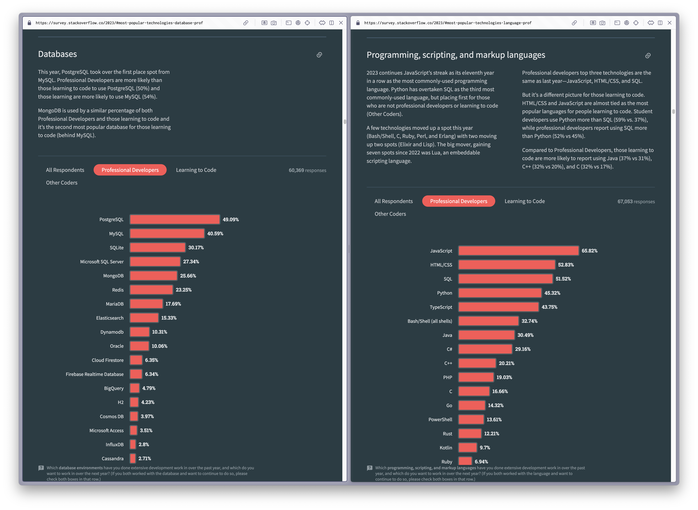

# Do we need an Abstraction for SQL?

> TLDR: ORMs are great until they aren't. ORMs are kind of awkward and suffer a lot from the last mile problem. They are very close to the 100% complete solution, but fall just short. Use the parts that makes sense for you. Use raw SQL for the rest.
>
> => Many people enjoy writing SQL.

## Introduction

[ThePrimeagen](https://twitter.com/ThePrimeagen) (I think he works at Netflix) recently published some videos about ORMs and SQL:

- [DONT USE AN ORM | Prime Reacts](https://youtu.be/bpGvVI7NM_k?feature=shared)
- [The Only Database Abstraction You Need | Prime Reacts](https://youtu.be/nWchov5Do-o?feature=shared)

He did a quick poll in one of those videos and people seem to enjoy writing SQL statements, which was a bit surprising to me. Approximately 50% of the people who voted chose SQL over ORMs and SQL query builders.


(Source: [DONT USE AN ORM | Prime Reacts](https://youtu.be/bpGvVI7NM_k?feature=shared))

SQL has been around since the 1970s, and was standardized by the American National Standards Institute in 1986 ([A Brief History of SQL and its Usefulness](https://www.coginiti.co/tutorials/introduction/what-is-sql/#:~:text=SQL%20has%20been%20around%20since,needs%20of%20the%20database%20industry.)).

It's incredible that **nearly half a century later** SQL is still the most used database technology and one of the most employed programming/scripting/markup languages, according to the [Stackoverflow Survey 2023](https://survey.stackoverflow.co/2023/), especially when many other software technologies struggle to endure beyond half a decade.


(Source: [Stackoverflow Survey 2023](https://survey.stackoverflow.co/2023/))

IMHO these are the main reasons for its success:

- Well-defined and standardized language
- Easy and simple
- High performance

## Comparison

The following examples illustrate why many people prefer raw SQL over abstractions. The examples are based on the same CRUD operations, but use different Javascript/Typescript packages.

In most cases, the raw SQL examples are shorter and more readable than the examples using SQL abstractions.

### Raw SQL

```sql
-- Create
INSERT INTO users (name, age) VALUES ('John', 30);

-- Read
SELECT * FROM users WHERE name = 'John' AND age < 40;

-- Update
UPDATE users SET age = 31 WHERE name = 'John';

-- Delete
DELETE FROM users WHERE name = 'John';
```

### Low level drivers (e.g.: mysql2)

```typescript
// Create
await sql(`INSERT INTO users (name, age) VALUES (?, ?)`, ["John", 30]);

// Read
const users = await sql(`SELECT * FROM users WHERE name = ? AND age < ?`, ["John", 40]);

// Update
await sql(`UPDATE users SET age = ? WHERE name = ?`, [31, "John"]);

// Delete
await sql(`DELETE FROM users WHERE name = ?`, ["John"]);
```

### TypeORM

```typescript
// Create
const user = new User();
user.name = "John";
user.age = 30;
await userRepository.save(user);

// Read
const users = await userRepository.find({ name: "John": age: LessThan(40) });

// Update
const userToUpdate = await userRepository.findOneBy({
  name: "John",
});
userToUpdate.age = 31;
await userRepository.save(userToUpdate);

// Delete
const userToDelete = await userRepository.findOneBy({
  name: "John",
});
await userRepository.remove(userToDelete);
```

### Prisma

```typescript
// Create
await prisma.user.create({
  data: {
    name: "John",
    age: 30,
  },
});

// Read
const users = await prisma.user.findMany({
  where: {
    name: "John",
    age: {
      lt: 40,
    },
  },
});

// Update
await prisma.user.update({
  where: {
    name: "John",
  },
  data: {
    age: 31,
  },
});

// Delete
await prisma.user.delete({
  where: {
    name: "John",
  },
});
```

### Drizzle

```typescript
// Create
await db.insert(users).values({
  name: "John",
  age: 30,
});

// Read
const users = await db
  .select()
  .from(users)
  .where(and(eq(users.name, "John"), lt(users.age, 40)));

// Update
await db.update(users).set({ age: 31 }).where(eq(users.name, "John"));

// Delete
await db.delete(users).where(eq(users.name, "John"));
```

### Knex.js

```javascript
// Create
await knex("users").insert({ name: "John", age: 30 });

// Read
const users = await knex("users").where({ name: "John" }).andWhere("age", "<", 40);

// Update
await knex("users").where({ name: "John" }).update({ age: 31 });

// Delete
await knex("users").where({ name: "John" }).del();
```

### Kysely

```typescript
// Create
await db.insertInto("users").values({ name: "John", age: 30 }).execute();

// Read
const users = await db.selectFrom("users").selectAll().where("id", "=", "John").where("age", "<", 40).execute();

// Update
await db.update("users").set({ age: 31 }).where("id", "=", "John").execute();

// Delete
await db.deleteFrom("users").where("id", "=", "John").execute();
```

## History of SQL Abstractions

ORMs are an abstraction over your database. It's an attempt to make SQL obsolete. Solving Problems in general ways means one of two things:

- Either it's technological breakthrough 📈
- or a middle of the road tradeoff 📉

By looking at the history of ORMs, it seems that ORMs are the latter. Here is a brief history of ORMs:

- early 1990s: The concept of ORMs emerges. The idea was to abstract away the database and make it easier to work with objects in the programming language. ([A brief history of Object Relational Mapping](https://antoniogoncalves.org/2008/09/27/)).
- 2000s: More sophisticated ORM frameworks emerge, such as [Hibernate](<https://en.wikipedia.org/wiki/Hibernate_(framework)>) for Java and [Entity Framework](https://en.wikipedia.org/wiki/Entity_Framework) for .NET.
- 2004-2006: People already noticed that ORMs are not the silver bullet they were promised to be and people like Ted Neward predicted the future of ORMs:

> Let's skip directly to the summary at the end which provides an great list of current (2006) and future solutions to the ORM problem:
>
> 1. **Abandonment** Developers simply give up on objects entirely
> 2. **Wholehearted acceptance**. Developers simply give up on relational storage entirely
> 3. **Manual mapping**. Developers simply accept that it's not such a hard problem to solve manually after all, and write straight relational-access code to return relations to the language, access the tuples, and populate objects as necessary.
> 4. **Acceptance of ORM limitations**. Developers simply accept that there is no way to efficiently and easily close the loop on the O/R mismatch, and use an ORM to solve 80% (or 50% or 95%, or whatever percentage seems appropriate) of the problem and make use of SQL and relational-based access to carry them past those areas where an ORM would create problems.
> 5. **Integration of relational concepts into the languages**
>
> Quoted from [Object-Relational Mapping is the Vietnam of Computer Science](https://blog.codinghorror.com/object-relational-mapping-is-the-vietnam-of-computer-science/)

- 2024:
  - Today there are more than 60+ SQL abstractions available where each of them has its own API. (see the appendix for a list of SQL abstractions)
    - It's been more than 30+ years of competition and still no clear winner, which clearly indicates that there is no one-size-fits-all solution and ORMs a middle of the road tradeoff.
  - We still don't have a concept for relational storage in the javascript language itself
  - and SQL is still the most used database technology.
  - Which leaves us with the following "solutions":
    - **Manual mapping**
    - **Acceptance of ORM limitations**.

## Benefits and Drawbacks of SQL Abstractions

Usually these kind of comparisons are very opinionated and biased. I tried my best to be as neutral as possible. I might have missed some points, or I might have been biased without noticing it. I'm open to feedback and I'm happy to update this document if you have any suggestions.

### Arguments against SQL Abstractions

- **Learning curve**: Devs need to learn another API, and need to remember and maintain it over the whole lifetime of the project. SQL has been around for almost half a century and will probably still be around when we start working on a new project (Maybe even in a different programming language). It's a good investment to learn and understand SQL!
- **Limited functionality**: While ORMs provide a lot of functionality, they can not support all of the features of a particular database. This can prevent us from taking advantage of advanced database features.
- **Lack of control**: SQL abstractions can limit the developer's control over the database. This can be a problem when we need to optimize the performance of the database.
- **Performance**: SQL abstractions are usually slower than raw SQL.
- **Debugging and Testing**: SQL abstractions can be hard to debug. With raw SQL, we can simply copy and paste the query into a database client and run it to see the results.
- **Documentation & Community**: SQL abstractions can have poor documentation. SQL has been around for a long time and has a large community. It's easier to find help and documentation for SQL.
- **Same low level drivers**: Most modern JS/TS SQL abstractions are build on top of the same low level drivers. E.g.: Drizzle, TypeORM, Kysely, are all using the same low level driver `mysql2` under the hood. The main difference between them is the API they provide.
- **Schema drift**: Database schema drift occurs when your database schema is out of sync with your migration history. The database schema has drifted away from the source of truth.
- **Additional Compilation Step**: SQL abstractions can have an additional compilation steps, which adds complexity to the build process.

### Arguments for SQL Abstractions

- **Type safety**: Modern SQL abstractions are usually type safe out of the box.
- **Auto-Complete**: Modern SQL abstractions usually have auto-complete suggestions in IDEs.
- **Input Validation**: Some SQL abstractions provide input validation out of the box.
- **Optimization & Caching**: Some SQL abstractions offer query optimizations and caching.
- **Security**: Modern SQL abstractions usually provide some security features. E.g.: to prevent SQL injection.
- **Migrations**: SQL abstractions can have migration tools, which can be useful.
- **Cross-Database Compatibility**: Many SQL abstractions are designed to abstract away the specific SQL dialects of different database systems, making it easier to switch between databases.
- **Connection Pooling**: SQL abstractions can have connection pooling.
- **Dynamic Query Construction**: It usually easier to dynamically construct queries based on runtime conditions.

sources:

- [Object–relational mapping](https://en.wikipedia.org/wiki/Object%E2%80%93relational_mapping)
- [The Only Database Abstraction You Need](https://youtu.be/tbfKZy7Y1pc?feature=shared)
- [The Only Database Abstraction You Need | Prime Reacts](https://youtu.be/nWchov5Do-o?feature=shared)
- [What ORMs have taught me: just learn SQL](https://wozniak.ca/blog/2014/08/03/1/index.html)
- [DONT USE AN ORM | Prime Reacts](https://youtu.be/bpGvVI7NM_k?feature=shared)
- [What are the benefits and drawbacks of using an ORM when working with databases?](https://www.quora.com/What-are-the-benefits-and-drawbacks-of-using-an-ORM-when-working-with-databases#:~:text=Benefits%3A,code%20needed%20to%20interact%20wit)
- [Schema Drift](https://www.prisma.io/docs/orm/prisma-migrate/workflows/troubleshooting#schema-drift)
- [What is Prisma?](https://www.prisma.io/docs/orm/overview/introduction/what-is-prisma)

## Appendix: Landscape of SQL Abstractions

There are many SQL abstractions available, including but not limited to:

- Java:
  - Apache Cayenne, open-source for Java
  - Apache OpenJPA, open-source for Java
  - DataNucleus, open-source JDO and JPA implementation (formerly known as JPOX)
  - Ebean, open-source ORM framework
  - EclipseLink, Eclipse persistence platform
  - Enterprise JavaBeans (EJB)
  - Enterprise Objects Framework, Mac OS X/Java, part of Apple WebObjects
  - Hibernate, open-source ORM framework, widely used
  - Java Data Objects (JDO)
  - JOOQ Object Oriented Querying (jOOQ)
  - Kodo, commercial implementation of both Java Data Objects and Java Persistence API
  - TopLink by Oracle
  - ...
- .Net
  - Base One Foundation Component Library, free or commercial
  - Dapper, open source
  - Entity Framework, included in .NET Framework 3.5 SP1 and above
  - iBATIS, free open source, maintained by ASF but now inactive.
  - LINQ to SQL, included in .NET Framework 3.5
  - NHibernate, open source
  - nHydrate, open source
  - Quick Objects, free or commercial
  - ...
- PHP
  - Laravel, framework that contains an ORM called "Eloquent" an ActiveRecord implementation.
  - Doctrine, open source ORM for PHP 5.2.3, 5.3.X., 7.4.X Free software (MIT)
  - CakePHP, ORM and framework for PHP 5, open source (scalars, arrays, objects); based on database introspection, no class extending
  - CodeIgniter, framework that includes an ActiveRecord implementation
  - Yii, ORM and framework for PHP 5, released under the BSD license. Based on the ActiveRecord pattern
  - FuelPHP, ORM and framework for PHP 5.3, released under the MIT license. Based on the ActiveRecord pattern.
  - Laminas, framework that includes a table data gateway and row data gateway implementations
  - Propel, ORM and query-toolkit for PHP 5, inspired by Apache Torque, free software, MIT
  - Qcodo, ORM and framework for PHP 5, open source
  - QCubed, A community driven fork of Qcodo
  - Redbean, ORM layer for PHP 5, for creating and maintaining tables on the fly, open source, BSD
  - Skipper, visualization tool and a code/schema generator for PHP ORM frameworks, commercial
  - ...
- Python
  - Django, ActiveRecord ORM included in Django framework, open source
  - SQLAlchemy, open source, a Data Mapper ORM
  - SQLObject, open source
  - Storm, open source (LGPL 2.1) developed at Canonical Ltd.
  - Tryton, open source
  - web2py, the facilities of an ORM are handled by the DAL in web2py, open source
  - Odoo – Formerly known as OpenERP, It is an Open Source ERP in which ORM is included.
  - ...
- Ruby
  - iBATIS (inactive)
  - ActiveRecord
  - DataMapper
  - ...
- Rust
  - Diesel, open source
  - seaORM, open source
  - sqlx, open source
  - ...
- Go
  - GORM, open source
  - SQLC, open source
  - SQLX, open source
  - SQLBOILER, open source
  - GORP, open source
  - Beego ORM, open source
  - ...
- Javascript/Typescript
  - Prisma, open source
  - Sequelize, open source
  - TypeORM, open source
  - Objection.js, open source
  - Bookshelf.js, open source
  - Waterline, open source
  - Mikro-ORM, open source
  - Knex.js, open source
  - ...

Used Sources:

- [List of object–relational mapping software](https://en.wikipedia.org/wiki/List_of_object%E2%80%93relational_mapping_software)
- [Comparing the 7 best ORM packages in Go](https://blog.logrocket.com/comparing-orm-packages-go/)
- [Top 22 Rust ORM Projects](https://www.libhunt.com/l/rust/topic/orm)

I counted 60+ SQL abstractions in the list above. I'm sure there are more out there. It's a bit overwhelming, isn't it? Imagine you are a backend developer and you need to switch between different projects, each of which uses a different SQL abstraction. You need to learn the API of each abstraction, and you need to remember the differences between them.
